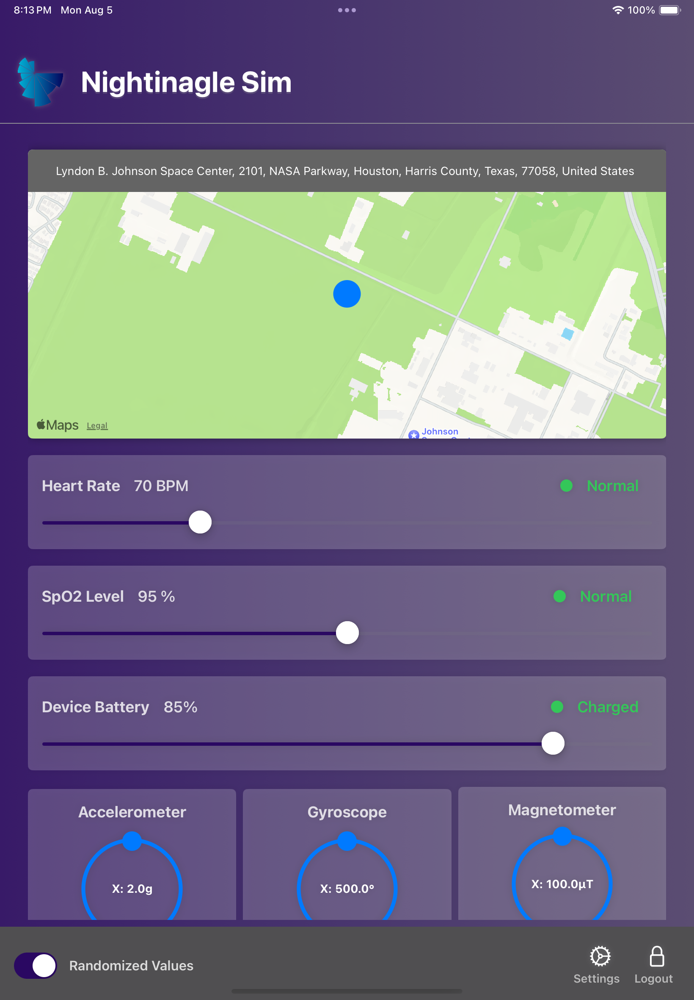
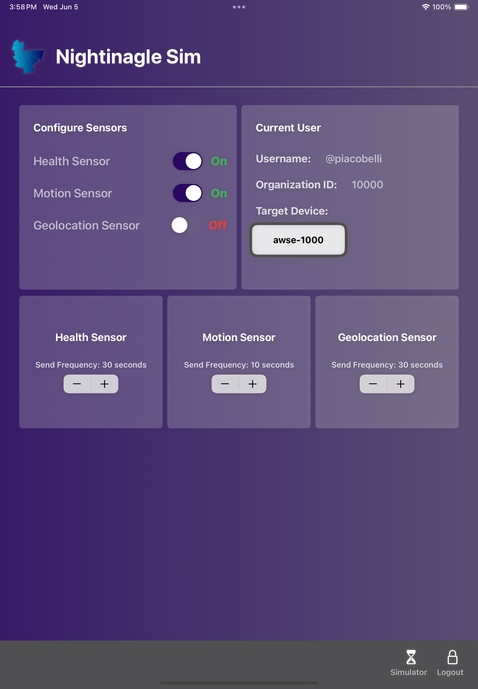
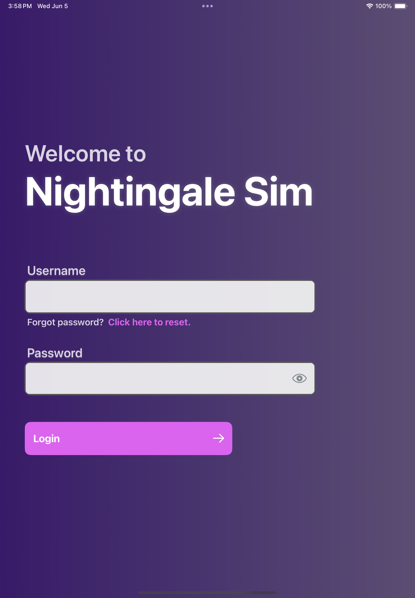

# Nightingale-Sim

The Nightingale team has developed state-of-the-art, in-house simulator tool designed to replace 
connected devices, Nightingale Sim streams personalized biometric data, motion data, geolocation 
data, and device metrics at customizable intervals. Fully compatible with the Vektor API, it 
features built-in authentication, allowing you to sign in with your Nightingale Health account and 
simulate data streams from any of your registered devices. The team is proud to offer this free software 
to all Nightinagle Health users. 

# Installation
Because this software does not currently exist as a directly downloadable application from the Apple app store, you will have to install XCode to download it to your devices. The only thing you will have to change is the code signature for the build target in the project file. Steps will be taken in the future to make the download process more user friendly.  

# Data Stream and Authentication
After installing to your device with an XCode editor, you can sign in with your Nightingale Health credentials. The app will access your device registry and give you a list of your unassigned devices to choose as the 'target device'. On the server side, it will appear as though the simulated data is being streamed from the device. If you don't have any devices available, you can simply register a fake device from the device manager in the Nightingale Health web platform to use for simulator specific tasks. 

# Sensor Data
Nightingale Sim offers the ability to stream simulated data in three distinct groups. 

- Biometric Data
  - Heart Rate
    - Range: 0-220 BPM
  - Breathing Rate
    - Range: 0-20 BrPM 
- Motion Data
  - 3 Vector Accelerometer
    - Range: -2.0-2.0 g
  - 3 Vector Gyroscope
    - Range: -500-500°
  - 3 Vector Magnetometer
    - Range: -100-100 µT
- Geolocation Data
  - Latitude
  - Longitude
  - Altitude (automatically gathered based on the selected coordinates)

These three sensors can be toggled on and off so you can stream only the simulated data you need for development. In addition, the frequency (in seconds) at which batch data is sent to the Vektor API can be adjusted to fit your specific requirements. 

# Simulator Dashboard

# Settings Dashboard

# Authentication Page

